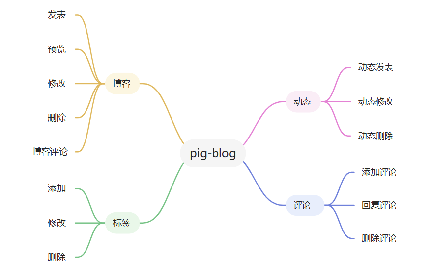
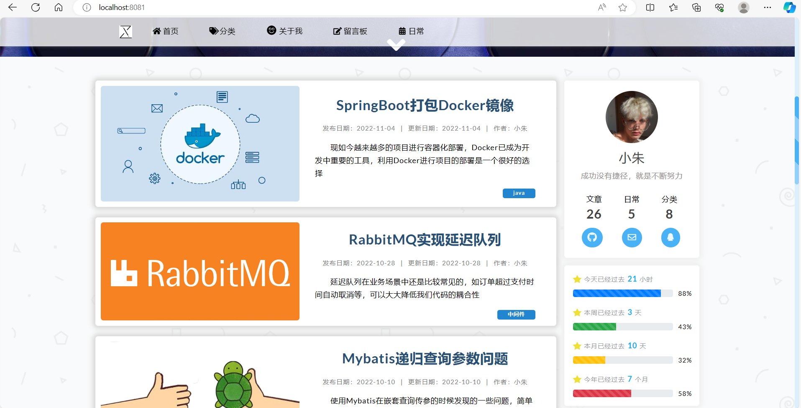
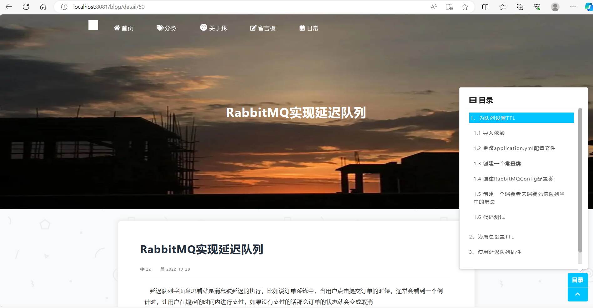
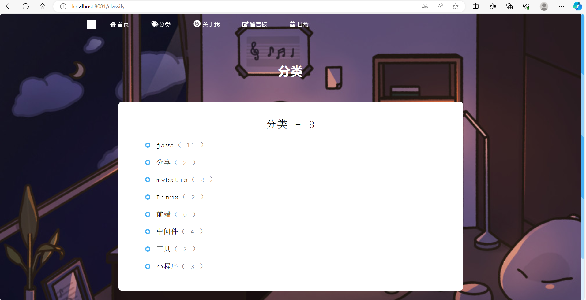
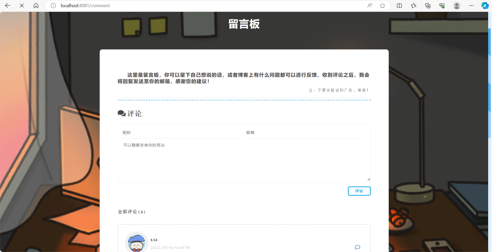
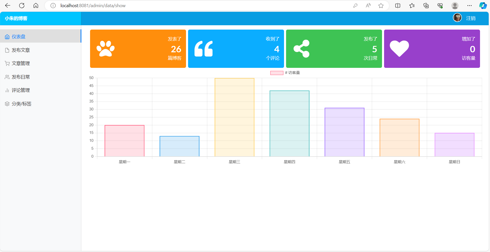
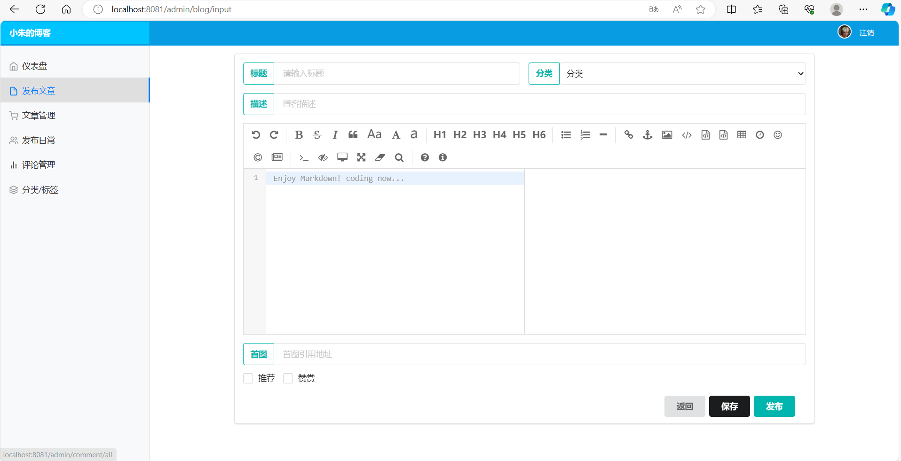
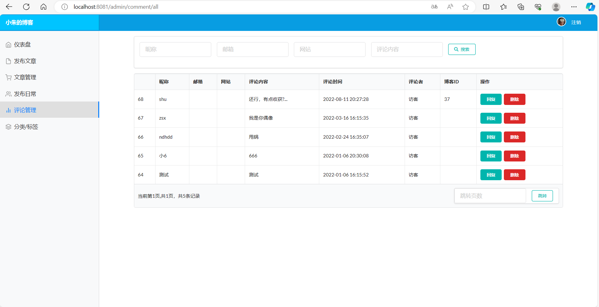

# pig-blog

#### 介绍
个人博客系统，作者可以发表对应的博客文章，在编辑博客的时候，可以预览对应的博客内容以便能够更好的发布，发布博客后，用户就能够浏览对应的博客文章，还可以进行评论互动，用户还可以根据标签进行博客的分类查看；并且还会开设有留言板块进行留言功能，有问题就可以在上面进行留言。

#### 技术栈

SpringBoot、SpringSecurity、Thymeleaf、Mybatis、Redis、MySQL

#### 功能预览

